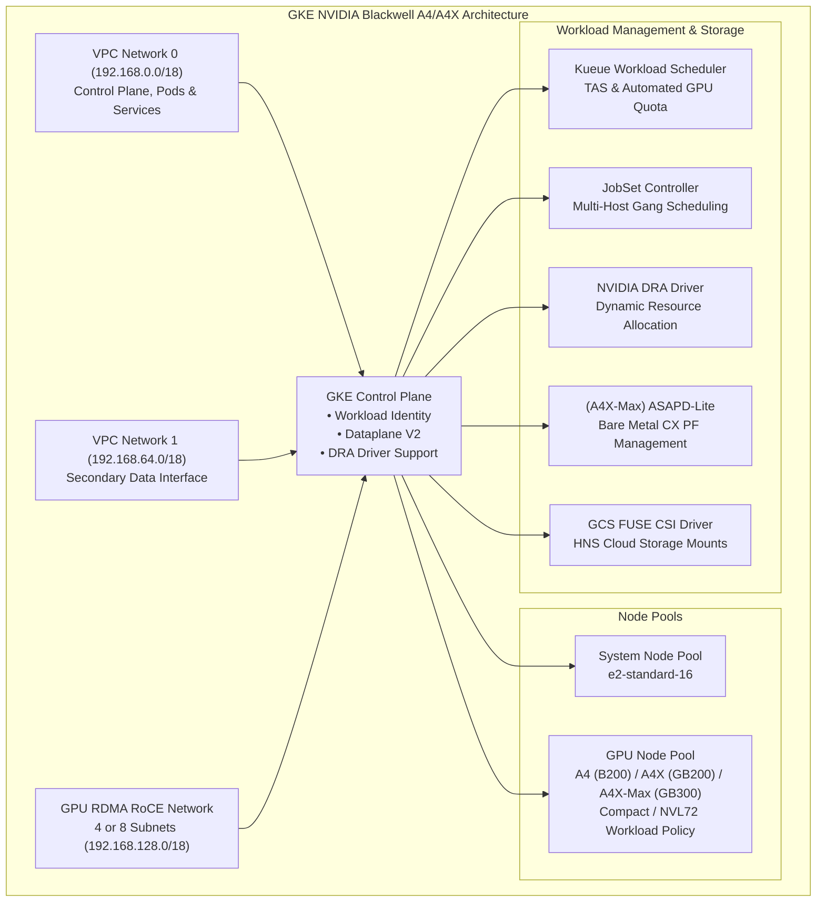

# Deploy an NVIDIA A4 / A4X GKE Cluster for ML Training

This directory contains a unified, production-ready Cluster Toolkit blueprint for provisioning **Google Kubernetes Engine (GKE) clusters accelerated with NVIDIA Blackwell architecture GPUs** across the entire A4 and A4X family: **A4 High (`a4-highgpu-8g`)**, **A4X High (`a4x-highgpu-4g`)**, and **A4X-Max Bare Metal (`a4x-maxgpu-4g-metal`)**.

---

## 1. Architecture Overview



### Key Architectural Highlights:
- **NVIDIA Blackwell GPU Family**:
  - **A4 High (`a4-highgpu-8g`)**: 8x NVIDIA B200 GPUs on x86_64 host with 8 dedicated RoCE subnets.
  - **A4X High (`a4x-highgpu-4g`)**: 4x NVIDIA GB200 GPUs on ARM64 host with NVL72 1x72 NVLink domain, DRANET, and 4 dedicated RoCE subnets.
  - **A4X-Max Bare Metal (`a4x-maxgpu-4g-metal`)**: 4x NVIDIA GB300 GPUs on ARM64 Bare Metal host with NVL72 1x72 NVLink domain, DRANET, ASAPD-lite, 2MB Hugepages, and 4 dedicated RoCE subnets.
- **Dynamic Resource Allocation (DRA)**: GKE managed Dynamic Resource Allocation driver (`nvidia-dra-driver`) for ANP and multi-networking on GB200/GB300 nodes.
- **Automated Kueue Quota & TAS**: Automatic Topology Aware Scheduling across topology blocks, subblocks, and nodepools.
- **Storage Integrations**: Hierarchical Namespace (HNS) Cloud Storage buckets with performance-tuned GCS FUSE Persistent Volumes and 1 TB local SSD scratch space.

---

## 2. Supported Machine Types & Specifications

| Hardware Flavor | Machine Type | GPU Accelerator | GPUs / Node | Host Architecture | RoCE Networks | Workload Topology | Key Features |
| :--- | :--- | :--- | :---: | :---: | :---: | :---: | :--- |
| **A4 High** | `a4-highgpu-8g` | NVIDIA B200 (180GB) | 8 | x86_64 | 8 | Compact (Distance 2) | PCIe/NVLink 8-GPU nodes, gIB RoCE |
| **A4X High** | `a4x-highgpu-4g` | NVIDIA GB200 | 4 | ARM64 | 4 | NVL72 (`1x72`) | NVLink 72-GPU liquid cooled rack, DRANET, Kueue TAS |
| **A4X-Max Bare Metal** | `a4x-maxgpu-4g-metal` | NVIDIA GB300 | 4 | ARM64 (Bare Metal) | 4 | NVL72 (`1x72`) | Bare Metal NVL72, ASAPD-Lite, 2MB Hugepages (4096), DRANET |

---

## 3. Prerequisites

1. **Project Allowlisting**:
   - For A4X and A4X-Max Bare Metal machine types, ensure your Google Cloud Project is allowlisted for the requested accelerator capacity.
2. **APIs & Service Quota**:
   - Enable GKE and Compute Engine APIs:
     ```bash
     gcloud services enable container.googleapis.com compute.googleapis.com
     ```
   - Ensure sufficient GPU quota for `nvidia-b200`, `nvidia-gb200`, or `nvidia-gb300` in your target region and zone.
3. **IAM Roles**:
   - Ensure your deployment identity has `roles/container.admin`, `roles/compute.admin`, `roles/iam.serviceAccountAdmin`, and `roles/resourcemanager.projectIamAdmin`.
4. **Cloud Storage Bucket**:
   - Create a bucket for Terraform state:
     ```bash
     gcloud storage buckets create gs://YOUR_TF_STATE_BUCKET --location=YOUR_REGION
     ```

---

## 4. Quickstart: Deployment Walkthrough

### Step 1: Select and Configure Deployment YAML
Choose the deployment template corresponding to your hardware:
- **A4 High (B200)**: [`a4-deployment.yaml`](./a4-deployment.yaml)
- **A4X High (GB200)**: [`a4x-deployment.yaml`](./a4x-deployment.yaml)
- **A4X-Max Bare Metal (GB300)**: [`a4x-max-bm-deployment.yaml`](./a4x-max-bm-deployment.yaml)

Edit the deployment YAML with your project details:
```yaml
terraform_backend_defaults:
  type: gcs
  configuration:
    bucket: YOUR_TF_STATE_BUCKET

vars:
  project_id: YOUR_PROJECT_ID
  deployment_name: gke-a4x
  region: us-central1
  zone: us-central1-a
  authorized_cidr: "YOUR_IP_ADDRESS/32"
  static_node_count: 2
  reservation: ""  # Set reservation name if using reserved capacity
  spot: false      # Set to true for Spot VMs
  queue_name: a4   # Local Kueue queue name
```

### Step 2: Deploy the Infrastructure

**For A4 High (B200):**
```bash
./gcluster deploy examples/gke-gpu-a4/gke-gpu-a4.yaml -d examples/gke-gpu-a4/a4-deployment.yaml
```

**For A4X High (GB200):**
```bash
./gcluster deploy examples/gke-gpu-a4/gke-gpu-a4.yaml -d examples/gke-gpu-a4/a4x-deployment.yaml
```

**For A4X-Max Bare Metal (GB300):**
```bash
./gcluster deploy examples/gke-gpu-a4/gke-gpu-a4.yaml -d examples/gke-gpu-a4/a4x-max-bm-deployment.yaml
```

### Step 3: Connect to the GKE Cluster
```bash
gcloud container clusters get-credentials DEPLOYMENT_NAME --region=REGION --project=YOUR_PROJECT_ID
```

Verify the GPU nodes are ready:
```bash
kubectl get nodes -l cloud.google.com/gke-accelerator=nvidia-gb200
```

---

## 5. Running Workloads & Benchmarks

Test manifests configured for each architecture are available in the [`workloads/`](./workloads/) directory:

### A. Run NCCL Performance Test via JobSet

* **For A4 High (B200)**:
  ```bash
  kubectl apply -f examples/gke-gpu-a4/workloads/a4-nccl-jobset.yaml
  kubectl get jobsets
  ```

* **For A4X High (GB200)**:
  ```bash
  kubectl apply -f examples/gke-gpu-a4/workloads/a4x-nccl-jobset.yaml
  kubectl get computedomains
  kubectl get jobsets
  ```

* **For A4X-Max Bare Metal (GB300)**:
  ```bash
  kubectl apply -f examples/gke-gpu-a4/workloads/a4x-max-nccl-jobset.yaml
  kubectl get computedomains
  kubectl get jobsets
  ```

Inspect test pod logs to verify bandwidth:
```bash
kubectl logs -l jobset.sigs.k8s.io/jobset-name=nccl-all -c nccl-test -f
```

### B. Run Kubeflow MPI Operator Workload
1. Deploy the Kubeflow MPI Operator (v0.8.2):
   ```bash
   kubectl apply --server-side -f https://raw.githubusercontent.com/kubeflow/mpi-operator/v0.8.2/deploy/v2beta1/mpi-operator.yaml
   ```
2. Submit the sample MPIJob:
   ```bash
   kubectl apply -f examples/gke-gpu-a4/workloads/sample-mpijob.yaml
   kubectl logs -l training.kubeflow.org/job-role=launcher -f
   ```

### C. Run Storage FIO Benchmarks
The blueprint generates an automated FIO benchmark job template measuring read/write throughput across local SSD scratch, training bucket reads, and checkpoint bucket writes:
```bash
kubectl apply -f <path-from-instructions.txt>/gcsfuse-fio-job.yaml
kubectl logs -l job-name=gcsfuse-fio-job -f
```

---

## 6. Capacity Management (Reservations & Spot VMs)

### Using Compute Engine Reservations
```yaml
vars:
  reservation: "my-blackwell-reservation"
  reservation_project_id: "my-reservation-owner-project"
  spot: false
```

### Using Spot VMs
```yaml
vars:
  reservation: ""
  spot: true
```

---

## 7. Storage Integrations

* **Cloud Storage Buckets with HNS**: Automatically provisions `training_bucket` and `checkpoint_bucket` with Hierarchical Namespace enabled.
* **GCS FUSE Persistent Volumes**: Mounts `/training-data` and `/checkpoint-data` into the cluster using GCS FUSE Storage Profiles.
* **Local SSD Ephemeral Storage**: Configures 1 TB ephemeral local SSD scratch space (`/scratch-data`) on GPU nodes.
* **Optional Managed Storage**: Includes commented-out configuration modules for Managed Lustre, Hyperdisk Balanced, and Filestore.

---

## 8. Clean Up

To avoid recurring charges, destroy the provisioned infrastructure:

```bash
./gcluster destroy DEPLOYMENT_NAME
```

> [!NOTE]
> GCS buckets created for Terraform state backend storage are retained by design upon `./gcluster destroy` and must be deleted manually if no longer needed.
