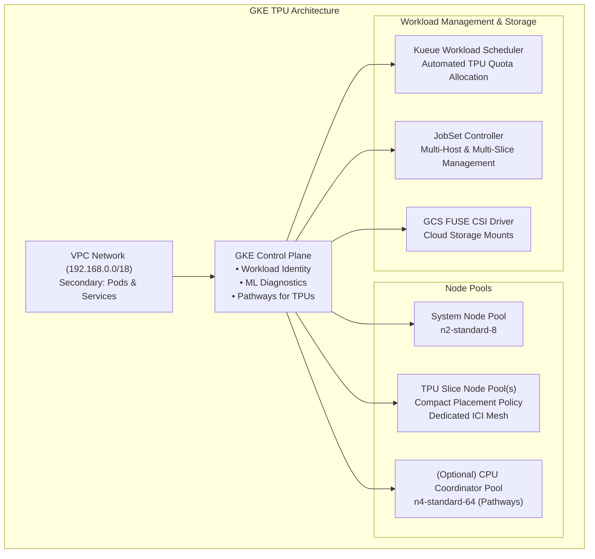

# GKE TPU Cluster Blueprint

This directory contains a unified, production-ready Cluster Toolkit blueprint for provisioning **Google Kubernetes Engine (GKE) clusters accelerated with Cloud TPUs** across all generations: **TPU v4**, **TPU v5e**, **TPU v5p**, **TPU v6e (Trillium)**, and **TPU 7x**.

---

## 1. Architecture Overview



### Key Architectural Highlights:
- **Inter-Chip Interconnect (ICI)**: TPU chips within a slice communicate directly over a dedicated optical network, independent of the host VPC.
- **Automated Kueue Quota**: Kueue is configured automatically based on your topology, machine type, and number of slices (`tpu_quota = num_slices * node_count * tpu_chips_per_node`).
- **Dynamic Capacity Management**: Seamlessly toggle between **Reservations**, **On-Demand**, and **Spot VMs** directly in your deployment YAML without modifying Terraform blueprint logic.
- **Pathways & ML Diagnostics**: Built-in support for Google Pathways (`enable_pathways_for_tpus`) and GKE ML Diagnostics.
- **Unified Storage Options**: Standard GCS FUSE CSI driver enabled by default, with optional support for Managed Lustre, Hyperdisk Balanced, and Filestore.

---

## 2. Supported TPU Generations & Machine Types

| Generation | Machine Type | TPU Chips / Host | Topology Format | Common Topologies | Accelerator Label | GKE Min Version |
| :--- | :--- | :--- | :--- | :--- | :--- | :--- |
| **TPU v4** | `ct4p-hightpu-4t` | 4 | 3D Mesh (`AxBxC`) | `2x2x1` (4c), `2x2x2` (8c), `2x4x4` (32c), `4x4x4` (64c) | `tpu-v4-podslice` | Regular |
| **TPU v5e (Lite)** | `ct5lp-hightpu-1t`<br>`ct5lp-hightpu-4t`<br>`ct5lp-hightpu-8t` | 1<br>4<br>8 | 2D Torus (`AxB`) | `2x2` (4c), `2x4` (8c), `4x4` (16c), `4x8` (32c), `8x8` (64c) | `tpu-v5-lite-podslice` | Regular |
| **TPU v5p** | `ct5p-hightpu-4t` | 4 | 3D Mesh (`AxBxC`) | `2x2x1` (4c), `2x2x2` (8c), `2x2x4` (16c), `2x4x4` (32c), `4x4x4` (64c) | `tpu-v5p-slice` | Regular |
| **TPU v6e (Trillium)** | `ct6e-standard-4t` | 4 | 2D Torus (`AxB`) | `2x4` (8c), `4x4` (16c), `4x8` (32c), `8x8` (64c), `16x16` (256c) | `tpu-v6e-slice` | `1.35.0-gke.3065000+` (for ML Diag) |
| **TPU 7x** | `tpu7x-standard-4t` | 4 | 3D / 2D Torus | `2x2x1` (4c), `2x2x2` (8c), `4x4x4` (64c) | `tpu7x` | `1.34.3-gke.1318000+` |

> [!NOTE]
> The node count for each slice is automatically calculated from the topology:
> $$\text{Nodes per Slice} = \frac{\prod \text{Topology Dimensions}}{\text{Chips per Machine}}$$
> For example, a `4x4` topology (16 chips) on `ct6e-standard-4t` (4 chips/host) provisions $\frac{16}{4} = 4\text{ nodes}$.

---

## 3. Quickstart: Deployment Walkthrough

### Prerequisites
1. **Google Cloud Project** with GKE and Compute Engine APIs enabled:
   ```bash
   gcloud services enable container.googleapis.com compute.googleapis.com
   ```
2. **IAM Roles** on the deployment account:
   - `roles/container.admin` (or `roles/container.clusterAdmin`)
   - `roles/compute.admin`
   - `roles/iam.serviceAccountAdmin`
   - `roles/resourcemanager.projectIamAdmin`
3. **Cloud Storage Bucket** for Terraform state:
   ```bash
   gcloud storage buckets create gs://YOUR_TF_STATE_BUCKET --location=YOUR_REGION
   ```

### Step 1: Configure Deployment YAML
Choose the deployment template corresponding to your TPU hardware:
- [`tpu-v4-deployment.yaml`](./tpu-v4-deployment.yaml)
- [`tpu-v5e-deployment.yaml`](./tpu-v5e-deployment.yaml)
- [`tpu-v5p-deployment.yaml`](./tpu-v5p-deployment.yaml)
- [`tpu-v6e-deployment.yaml`](./tpu-v6e-deployment.yaml)
- [`tpu-7x-deployment.yaml`](./tpu-7x-deployment.yaml)

Edit the variables in your chosen deployment YAML:
```yaml
terraform_backend_defaults:
  type: gcs
  configuration:
    bucket: YOUR_TF_STATE_BUCKET

vars:
  project_id: YOUR_PROJECT_ID
  deployment_name: gke-tpu-v6e
  region: us-east5
  zone: us-east5-c
  num_slices: 1
  machine_type: ct6e-standard-4t
  tpu_topology: 2x4
  authorized_cidr: "YOUR_IP_ADDRESS/32"
  reservation: ""  # Set reservation name if using reserved capacity
  spot: false      # Set to true to use Spot VMs
  queue_name: user-queue # Name of Kueue LocalQueue (defaults to user-queue)
```

### Step 2: Deploy the Cluster
```bash
./gcluster deploy -d examples/gke-tpu/tpu-v6e-deployment.yaml examples/gke-tpu/gke-tpu.yaml
```

### Step 3: Connect to the GKE Cluster
Once deployment completes, retrieve cluster credentials:
```bash
gcloud container clusters get-credentials DEPLOYMENT_NAME --region=REGION --project=YOUR_PROJECT_ID
```

Verify the TPU nodes are ready:
```bash
kubectl get nodes -l cloud.google.com/gke-tpu-accelerator=tpu-v6e-slice
```

---

## 4. Running Workloads & Benchmarks

The [`workloads/`](./workloads/) directory includes ready-to-run JAX test manifests configured for each TPU architecture and its default deployment topology:

### A. Run Generation-Specific Test Job
Submit the workload matching your deployed TPU generation:

* **TPU v4** (`ct4p-hightpu-4t`, topology `2x2x1`):
  ```bash
  kubectl apply -f examples/gke-tpu/workloads/tpu-v4-job.yaml
  kubectl get jobsets
  ```

* **TPU v5e** (`ct5lp-hightpu-4t`, topology `2x2`):
  ```bash
  kubectl apply -f examples/gke-tpu/workloads/tpu-v5e-job.yaml
  kubectl logs -l job-name=tpu-v5e-jax-job -f
  ```

* **TPU v5p** (`ct5p-hightpu-4t`, topology `2x2x1`):
  ```bash
  kubectl apply -f examples/gke-tpu/workloads/tpu-v5p-job.yaml
  kubectl get jobsets
  ```

* **TPU v6e** (`ct6e-standard-4t`, topology `2x4` / 2 hosts):
  ```bash
  kubectl apply -f examples/gke-tpu/workloads/tpu-v6e-job.yaml
  kubectl get jobsets
  kubectl logs -l jobset.sigs.k8s.io/jobset-name=tpu-v6e-jax-job -f
  ```

* **TPU 7x** (`tpu7x-standard-4t`, topology `2x2x1`):
  ```bash
  kubectl apply -f examples/gke-tpu/workloads/tpu-7x-job.yaml
  kubectl logs -l job-name=tpu-7x-jax-job -f
  ```

### B. Multi-Slice Distributed Training (JobSet)
For large-scale distributed training spanning multiple independent TPU slices:
```bash
kubectl apply -f examples/gke-tpu/tpu-multislice.yaml
```

### C. Kueue Scheduling & Quota Validation
All sample jobs include the label `kueue.x-k8s.io/queue-name: user-queue`. Verify workload admission:
```bash
kubectl get workloads
kubectl get clusterqueues
```

### D. Expected Device Count Verification (`jax.device_count()`)
JAX counts available devices according to hardware architecture:
- **TPU v4 / v5e / v5p / v6e**: 1 device per TPU chip.
  - Formula: $\text{Device Count} = \prod \text{Topology Dimensions}$
  - *Example*: A `2x4` topology reports `Global device count: 8`.
- **TPU 7x**: 2 TensorCores per TPU 7x chip.
  - Formula: $\text{Device Count} = (\prod \text{Topology Dimensions}) \times 2$
  - *Example*: A `2x2x1` (4 chips) topology reports `Global device count: 8`.

### E. ML Diagnostics Sample Workload Test (TPU v6e Only)
A packaged container test to validate GKE ML Diagnostics SDK integration, metric emission, and XPlane profiling is available in [`ml-diagnostics-sample-workload-test/`](./ml-diagnostics-sample-workload-test/):

> [!NOTE]
> This test suite is specifically configured for **TPU v6e (Trillium)** clusters (`ct6e-standard-4t`).

Follow the instructions in [`ml-diagnostics-sample-workload-test/README.md`](./ml-diagnostics-sample-workload-test/README.md) to build the test container in Artifact Registry and submit `sample_job.yaml`.

---

## 5. Running Pathways Workloads

This blueprint supports [**Pathways-on-Cloud**](https://github.com/AI-Hypercomputer/pathways-utils/) orchestration, allowing you to run JAX workloads distributed across remote TPU workers coordinated by a CPU-based head node.

### 1. Enable Pathways in the Blueprint
Set `enable_pathways_for_tpus: true` in your deployment or `gke-tpu.yaml`. This automatically provisions an autoscaling CPU coordinator node pool (`cpu-np`) and configures Pathways Kueue quotas.

### 2. Submit a Pathways Job via `gcluster` CLI
```bash
./gcluster job submit \
  --name pathways-job \
  --compute-type v6e-8 \
  --pathways \
  --pathways-gcs-location gs://YOUR_COORDINATION_BUCKET/pathways-scratch \
  --image us-docker.pkg.dev/cloud-tpu-images/jax-ai-image/tpu:latest \
  --command "pip install pathwaysutils && python -c 'import pathwaysutils; pathwaysutils.initialize(); import jax; print(\"JAX Device count:\", jax.device_count())'"
```

### 3. Monitor and Manage the Job
```bash
gcluster job logs pathways-job
gcluster job cancel pathways-job
```

---

## 6. Capacity Management (Reservations & Spot VMs)

### Using Compute Engine Reservations
Specify your reservation name in the deployment YAML:
```yaml
vars:
  reservation: "my-tpu-reservation"
  spot: false
```

### Using Spot VMs
Leave `reservation` empty and enable `spot`:
```yaml
vars:
  reservation: ""
  spot: true
```

### Using On-Demand Capacity
Leave both `reservation` empty and `spot: false`:
```yaml
vars:
  reservation: ""
  spot: false
```

---

## 7. Storage Integrations

The blueprint includes comprehensive support for high-performance ML storage:

* **Cloud Storage with GCS FUSE**: Automatically enabled via the GKE GCS FUSE CSI driver, providing high-throughput streaming access to training datasets and checkpoint storage.
* **Optional High-Performance Storage**:
  * **Managed Lustre**: Multi-petabyte parallel file system with up to 1 TB/s throughput for large checkpointing workloads.
  * **Hyperdisk Balanced**: Persistent block storage for high-IOPS scratch disks.
  * **Filestore**: Managed NFS for shared code, logs, and datasets across TPU worker nodes.

---

## 8. Alternative Consumption Options

For flexible scheduling and cost optimization:
* **Dynamic Workload Scheduler (DWS) Flex-Start**: Allows training workloads to queue and acquire capacity when available at lower cost.
* **Queued Provisioning (QP)**: Integrates with GKE to provision capacity asynchronously for pending large-scale jobs.

Refer to [GKE Consumption Options](../gke-consumption-options/) for complete blueprint examples.

---

## 9. Clean Up

To avoid recurring charges, tear down the provisioned infrastructure:

```bash
./gcluster destroy DEPLOYMENT_NAME
```

> [!NOTE]
> GCS buckets created for Terraform state backend storage are retained by design upon `./gcluster destroy` and must be deleted manually if no longer needed.
